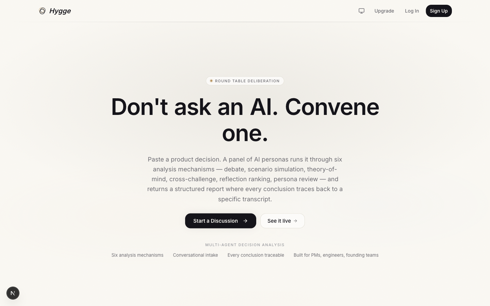
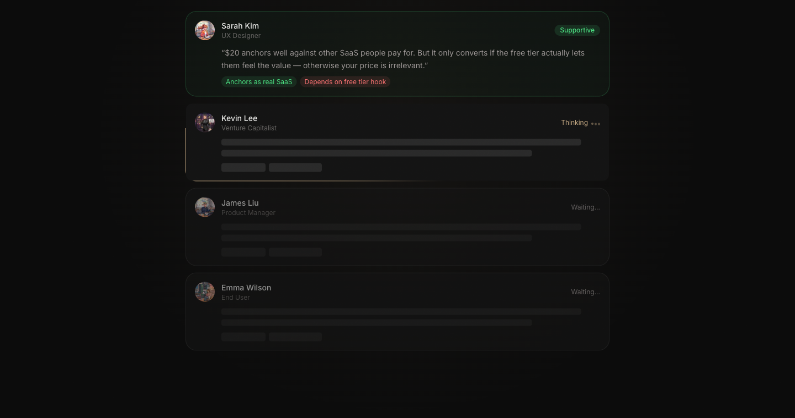
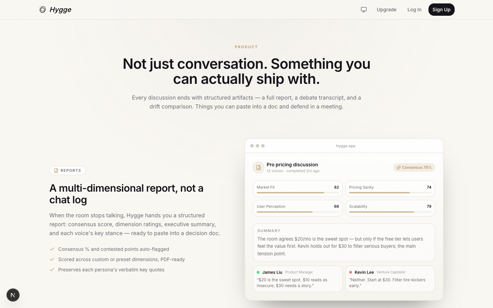
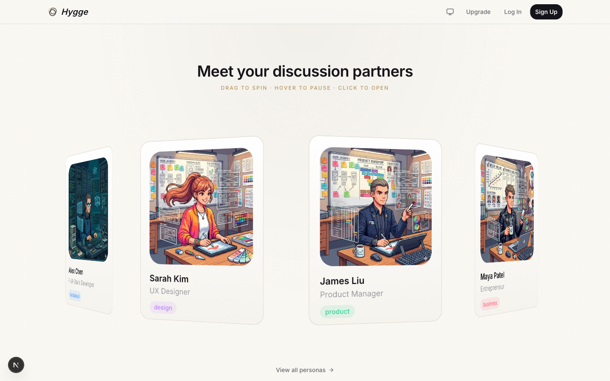

<div align="center">

# Hygge

**Don't ask an AI. Convene one.**

Multi-agent decision analysis. Paste a decision, and a panel of AI personas
runs it through six analysis mechanisms — then hands back a structured report
where every conclusion traces back to a specific transcript.

[](LICENSE)
[](https://nextjs.org)
[](https://react.dev)
[](https://www.typescriptlang.org)



</div>

---

## Why

Ask one chatbot a hard product question and you get one confident voice with
invisible reasoning. You cannot tell which parts were contested, which
assumptions carried the answer, or where it would break.

Hygge makes the deliberation itself the product. Multiple personas with
genuinely different priors argue the decision, disagree on the record, and the
final report keeps the receipts — click any conclusion and you land in the
transcript that produced it.

| | Single-model chat | Hygge |
|---|---|---|
| Perspectives | One voice | A panel with conflicting priors |
| Disagreement | Averaged away | Surfaced and flagged as contested |
| Provenance | None | Every finding links to its mechanism run |
| Output | Prose | Structured report: scores, stances, conflicts |

---

## How it works



A decision moves through three stages:

**1 · Conversational intake.** Instead of a settings form, an agent asks up to
three clarifying questions, extracts routing fields (decision type, stakes,
reversibility, timeline, dimensions), and seals a **decision brief**. You can
skip the questions and run immediately at any point.

**2 · Mechanism fan-out.** The orchestrator routes the brief to a subset of six
mechanisms, each a separate job with its own transcript:

| Mechanism | What it does |
|---|---|
| `persona_review` | Each persona reviews the decision independently, no cross-talk |
| `round_table_debate` | Multi-round open debate; personas react to each other |
| `theory_of_mind` | Simulates how a named stakeholder would receive the decision |
| `scenario_simulation` | Projects the decision forward over a chosen horizon |
| `cross_challenge` | Explicit proponent-vs-challenger pairings on specific claims |
| `reflection_ranker` | Ranks findings and flags contradictions between mechanisms |

**3 · Synthesis.** A synthesizer merges the runs into findings. When two
mechanisms reach contradictory conclusions on the same point, that contradiction
is not resolved silently — it is emitted as a `conflict_warning` finding you can
open and judge yourself.



Briefs are **immutable once finalized** — a database trigger blocks mutation of
routing fields after a brief leaves `draft`. Changing your mind creates a child
brief via `/rerun`, so the lineage of a decision stays auditable.

### The personas



Personas are first-class records, not prompt fragments: a persona has a
background, a discipline tag, an avatar, and can be forked, published to a
marketplace, or authored from scratch. Every persona utterance carries a 👍/👎
control, which feeds a labelled preference dataset.

---

## Architecture

Two long-running processes over Postgres and Redis:

```
┌────────────────────────────┐              ┌────────────────────────────┐
│  Next.js 16 (App Router)   │    HTTPS     │  Worker (Node)             │
│                            │ ───────────▶ │                            │
│  · /decide chat UI         │  shared      │  · BullMQ consumers        │
│  · /api/decisions/*        │  secret      │  · LLM fallback chain      │
│  · Stripe, auth, admin     │              │  · Tavily web grounding    │
└─────────────┬──────────────┘              └─────────────┬──────────────┘
              │                                           │
              │        Supabase — Postgres + RLS          │
              └────────── + Realtime publication ─────────┘
                                   │
                    Redis — BullMQ queues + rate limits
```

Four queues carry the work:

- `evaluations` — round-table evaluations (the original product surface)
- `decision-intake` — the conversational state machine (extract → ask → seal)
- `decision-orchestrator` — fans out mechanism jobs, then runs the synthesizer
- `decision-mechanism` — six job names share this queue, one per mechanism

The Next.js side never calls an LLM provider directly in production; it proxies
to the worker, which owns the fallback chain. That keeps provider keys on one
host and lets the chain hop providers when one refuses or times out.

### Repository layout

```
src/
  app/[locale]/      Localized pages (en · zh) — landing, decide, personas, settings
  app/api/           Route handlers — decisions, personas, stripe, admin, cron
  components/        UI by feature: decide, landing, personas, settings, ui
  lib/               auth · billing · decide · llm · queue · rate-limit · supabase
shared/types/        Types imported by BOTH the app and the worker
worker/src/
  processors/        One file per job kind — the mechanisms live here
  queue.ts           Queue + Worker construction, concurrency
supabase/migrations/ Ordered SQL migrations (001 → 069)
messages/            en.json · zh.json (next-intl)
tests/               App-side vitest; worker/tests/ for the worker
```

---

## Quick start

**Prerequisites:** Node 20+, a [Supabase](https://supabase.com) project, a Redis
instance (local or [Upstash](https://upstash.com)), and one OpenAI-compatible
LLM endpoint. The LLM layer is provider-agnostic — anything that speaks the
OpenAI chat-completions shape works, plus native Anthropic and Google adapters.

```bash
git clone https://github.com/Kyle-zhai/Hygge.git
cd Hygge
npm install
```

### 1 · Environment

Two env files, read by two different processes:

```bash
cp .env.example .env.local        # Next.js: Supabase, Stripe, analytics, worker URL
cp worker/.env.example worker/.env # Worker: LLM chain, Redis, service-role key
```

Both are documented inline. The minimum to boot the app is
`NEXT_PUBLIC_SUPABASE_URL` and `NEXT_PUBLIC_SUPABASE_ANON_KEY`; the minimum to
run a decision end-to-end adds `REDIS_URL` and one `LLM_1_*` group in
`worker/.env`.

### 2 · Database

```bash
npm run db:migrate   # apply migrations in order
# npm run db:reset   # drop and rebuild from scratch
```

### 3 · Run

```bash
npm run dev          # Next.js  → http://localhost:3000
npm run dev:worker   # Worker   (separate terminal)
```

The worker must be running for any decision to execute. Without it the chat
accepts messages but no intake or orchestrator job is ever consumed.

### 4 · Verify

```bash
npm run typecheck:all   # app + worker
npm test                # app-side vitest
npm run test:worker     # worker-side vitest
npm run lint
```

---

## Configuration notes

**LLM fallback chain.** Up to ten numbered provider groups (`LLM_1_*` through
`LLM_10_*`) are tried in order. A permanent failure — 401, 403, 404, quota —
blocks that entry for the rest of the session rather than retrying it. Content
refusals are treated as fallbackable, so keep at least one provider from a
different jurisdiction in the chain if you run bilingual traffic.

**BYOK.** Users can save their own provider chain at `/settings/llm`, which
overrides the env defaults per request. Keys are encrypted at rest using
`LLM_KEY_ENCRYPTION_SECRET` (any string ≥16 chars; generate with
`openssl rand -base64 32`).

**Web grounding.** `TAVILY_API_KEY` enables source-cited findings. Without it,
mechanisms that would cite external evidence emit "no authoritative source
found" instead of a citation.

**Admin panel.** `/admin` is deny-by-default. Access requires an exact match
against the comma-separated `ADMIN_EMAILS` list.

---

## Database conventions

These bite people who assume otherwise:

- **`personas.id` is `TEXT`, not `UUID`.** Every FK column referencing
  `personas(id)` must be `text` / `text[]`.
- **Decision briefs are immutable post-finalize.** A trigger blocks mutation of
  routing fields once `status` leaves `draft`. Use `/rerun` to create a child.
- **One draft brief per session**, enforced by a partial unique index.
- **`parent_brief_id` chain depth is capped at 8** by a trigger.

---

## Security model

- Row-level security on every user-owned table; the service-role key never
  reaches the browser.
- All user-supplied text is wrapped in `<user_input>` fences before it reaches a
  prompt, and LLM-returned enums and array shapes are re-validated against the
  schema before being persisted.
- LLM-trigger surfaces are rate limited (`decisionMessages` 60/min/user,
  `decisionRerun` 10/h/user).
- Stripe webhooks are idempotent and signature-verified.

---

## Deployment

The Next.js app deploys to Vercel (region `hkg1`, cron jobs declared in
`vercel.json`). The worker deploys independently — it ships with a `Dockerfile`
and a `railway.toml`, but anything that runs a long-lived Node process works.

They only need to agree on three things: the same Redis, the same Supabase
project, and a matching `WORKER_SHARED_SECRET`.

---

## Contributing

Issues and pull requests are welcome. Before opening a PR:

```bash
npm run typecheck:all && npm run lint && npm test && npm run test:worker
```

CI runs typecheck, lint, and the app-side test suite on every pull request.

---

## License

[MIT](LICENSE) © Yinan Zhai
