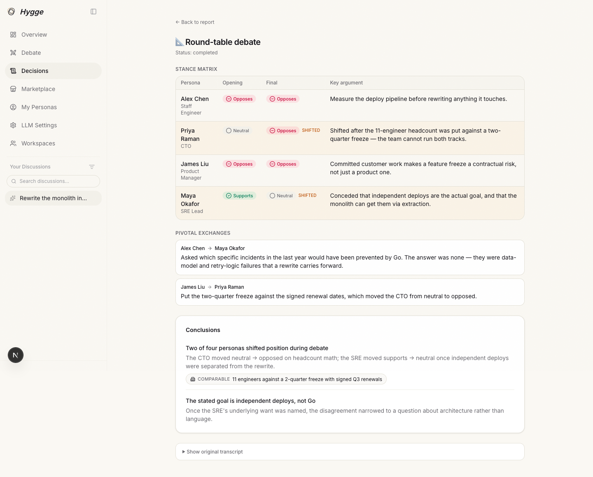
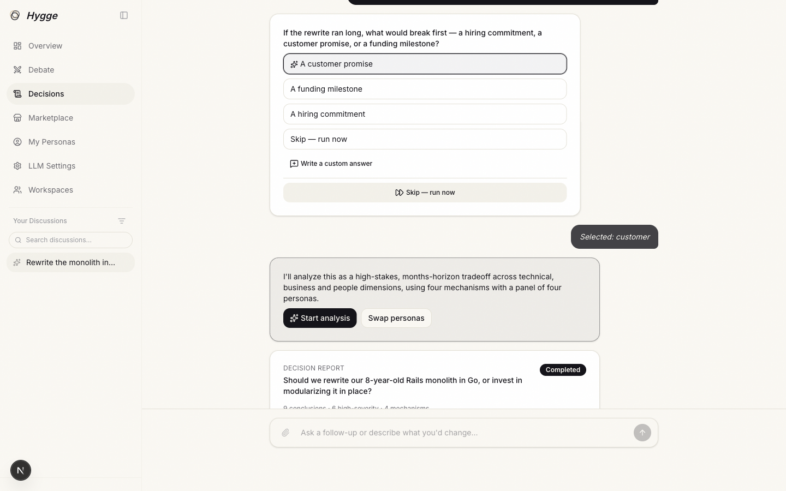
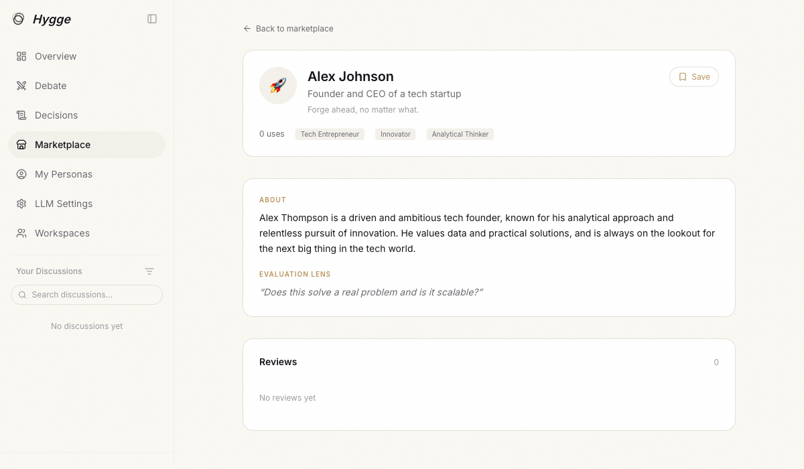

# Hygge

**Multi-agent decision analysis with traceable provenance.**

You describe a decision. A panel of AI personas argues it through six analysis
mechanisms. You get back a structured report in which every conclusion stores a
foreign key to the transcript that produced it.

[](LICENSE)
[](https://nextjs.org)
[](https://react.dev)
[](https://www.typescriptlang.org)


---

## Try it without setting anything up

Demo mode serves one complete, pre-built decision — *"rewrite our Rails
monolith in Go, or modularize it in place?"* — with no auth, no worker, no
database and no LLM key:

```bash
git clone https://github.com/Kyle-zhai/Hygge.git && cd Hygge && npm install
NEXT_PUBLIC_DEMO_MODE=true npm run dev
```

Open `localhost:3000/en/decide` and the finished analysis is there: the intake
conversation, nine findings across four mechanisms, every transcript, and a
flagged conflict between two of them.

---

## What it produces

Not a chat log. Four artifacts, each addressable:

**Typed findings.** Every mechanism emits the same shape, which is what makes a
debate result and a scenario projection comparable:

```ts
{ headline, severity: 1..5, confidence: 0..1, detail_summary, cited_persona_ids }
```

**Provenance as a foreign key.** Each persisted finding carries
`mechanism_run_id` — a row pointer to the run whose transcript you can open.
Traceability is enforced by the schema, not asserted by the model.

**Surfaced disagreement.** When two mechanisms reach contradictory conclusions
on the same point, the contradiction is not averaged away. It becomes its own
finding, `source_mechanism: "conflict_warning"`, for you to judge.

**An auditable intake trail.** Every routing field records the confidence and
the verbatim user quote it came from, so nothing is silently inferred:

```ts
{ value, confidence, source_quote: string | null, was_asked: boolean }
```

---

## The six mechanisms

One brief fans out to a routed subset. Each becomes its own job, row, and
transcript.

| Mechanism | What it does |
|---|---|
| `persona_review` | Each persona reviews independently — no cross-talk |
| `round_table_debate` | Multi-round debate; personas react to each other |
| `theory_of_mind` | Simulates how a named stakeholder receives the decision |
| `scenario_simulation` | Projects the decision forward over a horizon |
| `cross_challenge` | Explicit proponent-vs-challenger pairings |
| `reflection_ranker` | Ranks findings, flags contradictions across mechanisms |

Opening any conclusion lands in the run behind it — stance shifts, the exchange
that caused them, and the raw transcript underneath:



---

## What makes it different

**Conversational intake, not a settings form.** An agent extracts routing
fields from what you wrote and asks at most three clarifying questions. The run
is always one click away; `sealed_by` records how intake ended — filled,
skipped, budget-exhausted, or timed out.



**Decisions are immutable and versioned.** A database trigger blocks mutation
of routing fields once a brief leaves `draft`. Changing your mind creates a
child brief through `/rerun`, so the lineage of a decision survives — it isn't
overwritten.

**Personas are records, not prompt fragments.** Each has a background, a
discipline tag, an avatar and an evaluation lens. They can be forked, published
to a marketplace, or authored from scratch.



**Provider-agnostic with real failover.** Up to ten LLM providers are tried in
order. A permanent failure (401/403/404/quota) blocks that entry for the
session instead of being retried. Content refusals count as fallbackable, so a
chain spanning jurisdictions keeps bilingual traffic working. Users can bring
their own keys, encrypted at rest.

**Bilingual throughout** — English and Chinese, via next-intl.

---

## Architecture

Two long-running processes over Postgres and Redis. The web tier never calls an
LLM provider directly; it proxies to the worker, which owns the fallback chain
and keeps provider keys on one host.

```
┌────────────────────────────┐              ┌────────────────────────────┐
│  Next.js 16 (App Router)   │    HTTPS     │  Worker (Node)             │
│  · /decide chat UI         │ ───────────▶ │  · BullMQ consumers        │
│  · /api/decisions/*        │   shared     │  · LLM fallback chain      │
│  · Stripe, auth, admin     │   secret     │  · Tavily web grounding    │
└─────────────┬──────────────┘              └─────────────┬──────────────┘
              │       Supabase — Postgres + RLS           │
              └────────── + Realtime publication ─────────┘
                                   │
                    Redis — BullMQ queues + rate limits
```

Four queues: `evaluations`, `decision-intake`, `decision-orchestrator`, and
`decision-mechanism` (six job names share the last one).

---

## Run it

Needs Node 20+, Supabase, Redis, and any OpenAI-compatible LLM endpoint.

```bash
git clone https://github.com/Kyle-zhai/Hygge.git && cd Hygge && npm install
cp .env.example .env.local          # web
cp worker/.env.example worker/.env  # worker — required, tests read it too
npm run db:migrate
npm run dev          # web    → localhost:3000
npm run dev:worker   # worker → separate terminal, required for any decision
```

Both `.env.example` files document every variable inline. Verify with
`npm run typecheck:all && npm test && npm run test:worker`.

<details>
<summary><b>Conventions that bite</b></summary>

- **`personas.id` is `TEXT`, not `UUID`** — every FK to it must be `text` / `text[]`.
- **Briefs are immutable post-finalize** — use `/rerun`; `parent_brief_id` depth caps at 8.
- **One draft brief per session**, enforced by a partial unique index.
- **User text is fenced** in `<user_input>` before reaching a prompt; LLM-returned
  enums and array shapes are re-validated before being persisted.
- **RLS on every user-owned table**; the service-role key never reaches the browser.
- **Rate limits**: `decisionMessages` 60/min/user, `decisionRerun` 10/h/user.

</details>

---

## License

[MIT](LICENSE) © Yinan Zhai
